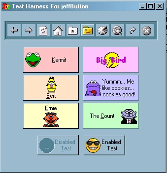



## jeffButton / jeffSplitter \- replacement for vb command button and simple splitter control

### Description

O.K. This is the debut of both jeffButton and jeffSplitter. =) jeffButton is a custom control replacement for the VB command button. The enhancements it provides are: location of the caption, providing for the "soft button" effect, and most importantly, automatically creating disabled versions of your button icons... just like the standard vb toolbar. However, I must state now that the API calls I use to achieve this are newer, and probably won't work in Win95 and potentially early versions of Win98 and NT. Works fine on current Win98se, WinME, and Win2K. Anyways... the controls also demonstrates the mouse capturing API calls. The button control also supports hot and disabled icons if you so wish to provide them. =) Addditionally, this project post also exhibits my custom splitter control. I think, at the least, you will find my approach unique. Again, this control demonstrates the mouse capturing API calls. You can set the splitter's orientation, and bounds. And event fires every time the bar moves, allowing you to custom resize controls at will... which is what I like to do. Most implementations I have seen of splitter controls that automatically resize controls for you aren't very complicated, or else they end up adding a lot of overhead. jeffSplitter is simply and based on Edanmo's VB5 ocx splitter controls which provide the splitter but allow you the flexability to implement your own resize techniques (useful when a frame or toolbar is resized in the same section along with a grid or treeview). =) Anyways... hope you guys enjoy my latest offering. I cut with my previous policy of distinguishing between public and private code on this project, so additionally, any of you code hounds out there will also find in this project a rich library of base vb functions and API function definitions and constants in the two files: tools6.bas and mapiconstants.bas. =) I use this module base in both work and recreation projects. If you like it or the latest controls, please gimme a vote. ;) (it don't take long to vote, honest)
 
### More Info
 

             |
---                |---
**Submitted On**   |2001-05-04 22:05:12
**By**             |[TheFrogPrince](https://github.com/Planet-Source-Code/PSCIndex/blob/master/ByAuthor/thefrogprince.md)
**Level**          |Intermediate
**User Rating**    |4.8 (48 globes from 10 users)
**Compatibility**  |VB 6\.0
**Category**       |[Custom Controls/ Forms/  Menus](https://github.com/Planet-Source-Code/PSCIndex/blob/master/ByCategory/custom-controls-forms-menus__1-4.md)
**World**          |[Visual Basic](https://github.com/Planet-Source-Code/PSCIndex/blob/master/ByWorld/visual-basic.md)
**Archive File**   |[jeffButton19226552001\.zip](https://github.com/Planet-Source-Code/thefrogprince-jeffbutton-jeffsplitter-replacement-for-vb-command-button-and-simple-splitte__1-22959/archive/master.zip)

